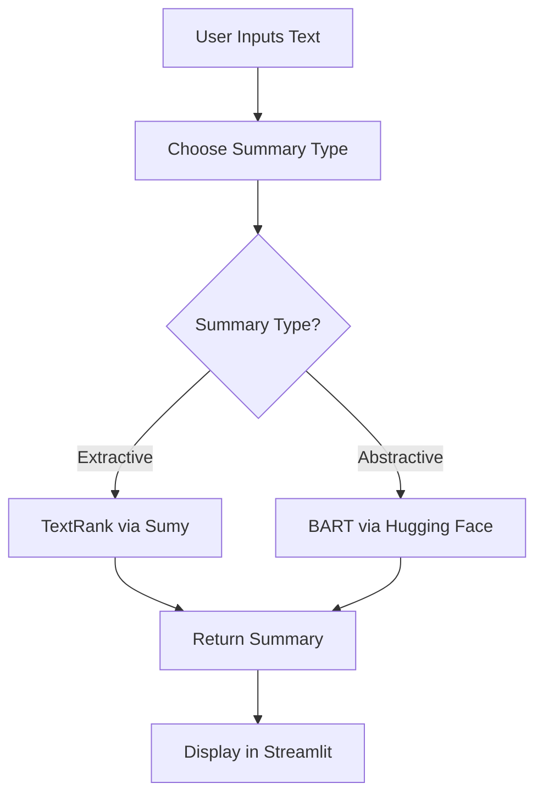

# ✂️ TextSummarizer – Extractive & Abstractive Text Summarization Tool

  
  
  


> 📚 A Streamlit-based NLP app that summarizes large text documents using both extractive (TextRank) and abstractive (BART) techniques.

---

## 🚀 Features

- ✂️ **Extractive Summarization** using TextRank algorithm via Sumy  
- 🧠 **Abstractive Summarization** using Hugging Face's BART model  
- 💡 Intuitive **Streamlit UI** for input and output  
- 📝 Handles custom inputs such as news articles, reports, and essays  
- 📏 Adjustable summary length for tailored outputs  

---

## 📌 Technologies Used

| Component       | Tool/Library                   |
|----------------|----------------------------------|
| Extractive Model | TextRank (Sumy)                |
| Abstractive Model | BART (`facebook/bart-large-cnn`) |
| NLP Utilities   | NLTK, Transformers              |
| Web UI         | Streamlit                        |
| Language       | Python 3.10+                     |

---

## ⚙️ Installation

```bash
git clone https://github.com/akasha456/TextSummarizer-NLP-based-Text-Summarization-Tool
cd TextSummarizer-NLP-based-Text-Summarization-Tool
pip install -r requirements.txt
streamlit run app.py

```
---

## 🧠 How It Works



---

## 📊 Example Output Snapshot

| Sentiment | Count |
|-----------|-------|
| 👍 Good   | 52    |
| 👎 Bad    | 27    |
| 😐 Neutral | 21    |

---

## 🌐 Future Enhancements

- 🗃️ Save comment history and results to CSV
- 🧠 Upgrade to deep learning-based sentiment models
- 📱 Deploy as mobile-friendly PWA
- 🌍 Multilingual comment support (translation + sentiment)

---

## 📜 License

This project is licensed under the MIT License.

---

## 💬 Acknowledgements

- [YouTube Data API](https://developers.google.com/youtube/v3)
- [scikit-learn](https://scikit-learn.org)
- [Streamlit](https://streamlit.io)
- [Plotly](https://plotly.com)

---
## ✨ Output Samples

| Type | Original Text | Summary |
|------|---------------|---------|
| Extractive | *News article about AI* | *First 3 ranked sentences* |
| Abstractive | *500-word blog post* | *Condensed abstract overview* |

---

## 🌐 Future Enhancements

- 🗂️ File upload for summarizing PDFs and DOCX  
- 🎙️ Speech-to-text support  
- 🌍 Language detection and multilingual support  
- 🔗 Summarization of URLs or web content  
- 📊 Evaluation using ROUGE, BLEU metrics  

---

## 📜 License

This project is licensed under the MIT License.

---

## 💬 Acknowledgements

- [Hugging Face Transformers](https://huggingface.co/transformers/)  
- [Sumy](https://github.com/miso-belica/sumy)  
- [Streamlit](https://streamlit.io)  
- [NLTK](https://www.nltk.org/)

---
