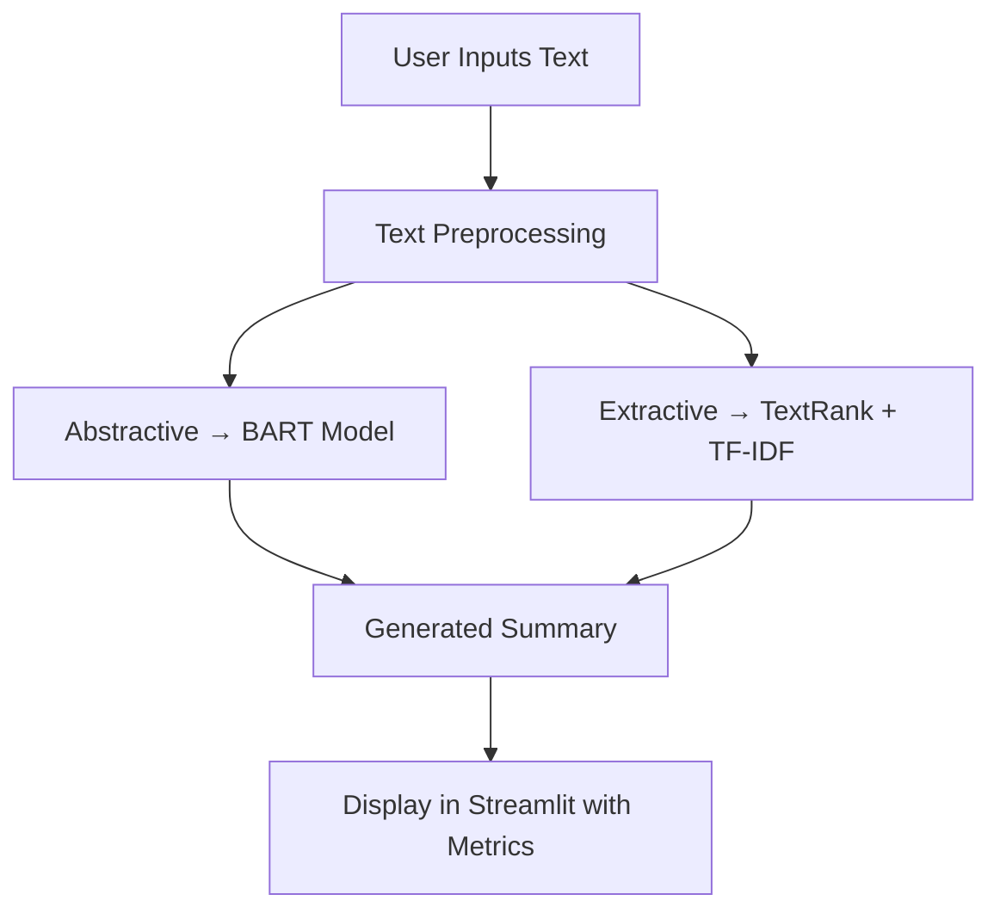

# 🧾 Advanced Text Summarizer


> ✨ A dual-mode summarization app using Abstractive (BART) and Extractive (TextRank) methods. Built with Streamlit and cutting-edge NLP libraries for efficient and human-like summarization.

---

## 🚀 Features

* 🧠 **Abstractive Summarization** via Facebook's BART model
* 🧩 **Extractive Summarization** using a custom TextRank algorithm
* 🔀 **Comparison Mode** to view both summaries side-by-side
* 📏 **Compression Ratio & Word Count Metrics**
* 🔧 Real-time configuration of summary length/sentence count
* 📎 Intelligent text chunking for long documents
* 📜 Preloaded sample texts and word count validation
* 💻 Streamlit-powered responsive UI with progress indicators

---

## 📌 Technologies Used

| Component         | Tool/Library                                    |
| ----------------- | ----------------------------------------------- |
| Abstractive Model | `facebook/bart-large-cnn` (Transformers)        |
| Extractive Method | Custom TextRank with TF-IDF & cosine similarity |
| Graph Algorithm   | PageRank via NetworkX                           |
| Tokenization      | NLTK (`punkt`, `stopwords`)                     |
| Frontend          | Streamlit                                       |
| ML Tools          | scikit-learn, PyTorch, NumPy                    |

---

## ⚙️ Installation

```bash
git clone https://github.com/akasha456/TextSummarizer
cd TextSummarizer
pip install -r requirements.txt
streamlit run app.py
```

---

## 🧠 How It Works



---

## 📊 Configuration Options

| Mode            | Parameters                                                              |
| --------------- | ----------------------------------------------------------------------- |
| **Abstractive** | Max Length: 50–300 (default: 150) <br> Min Length: 20–100 (default: 50) |
| **Extractive**  | Number of Sentences: 1–10 (default: 3)                                  |

---

## 📂 Project Structure

```
text-summarizer/
├── app.py              # Streamlit frontend
├── summarizers.py      # BART & TextRank implementations
├── utils.py            # Text processing utilities
├── config.py           # Constants and app settings
├── requirements.txt    # Python dependencies
└── README.md           # Project documentation
```

---

## 📈 Performance Features

* ⚡ **Caching** for BART model and NLTK downloads
* 📦 **Chunking** logic to handle large inputs
* 🧩 **TF-IDF Cosine Similarity** + PageRank for extractive scoring
* ❗ **Error Handling** with user-friendly messages

---

## 📝 Sample Texts

Includes the following built-in examples:

* 🧠 **Technology** – AI and ML overview
* 🌍 **Scientific** – Climate change research

---

## 📏 Metrics Tracked

| Metric                | Description                                |
| --------------------- | ------------------------------------------ |
| **Compression Ratio** | Percentage reduction in summary            |
| **Word Count**        | Real-time display of input length          |
| **Processing Time**   | UI-based feedback while generating summary |

---

## 🙌 Contributing

1. Fork the repository
2. Create a new branch: `git checkout -b feature/your-feature`
3. Commit your changes: `git commit -m "Add awesome feature"`
4. Push the branch: `git push origin feature/your-feature`
5. Submit a Pull Request 🚀

---

## 📜 License

This project is licensed under the MIT License.

---

## 💬 Acknowledgements

* [Facebook AI](https://ai.facebook.com) for the BART model
* [Hugging Face Transformers](https://huggingface.co/transformers)
* [NetworkX](https://networkx.org) for graph-based algorithms
* [Streamlit](https://streamlit.io) for the web interface
* [NLTK](https://www.nltk.org) and [scikit-learn](https://scikit-learn.org) for NLP utilities

---

## 📸 Screenshots

 <!-- Replace with actual screenshot URL -->

---

